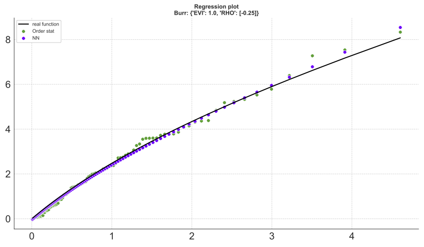
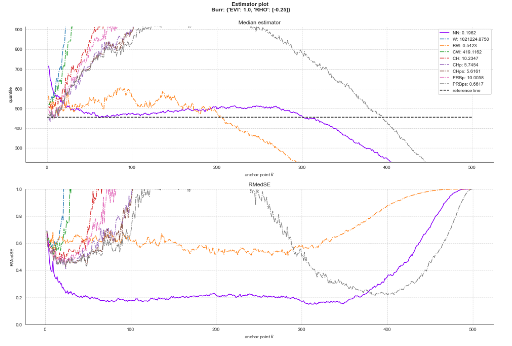

# Estimation of extreme quantiles from heavy-tailed distributions with neural networks
Implementation of the paper ["Estimation of extreme quantiles from heavy-tailed distributions with neural networks", 2022](LINK),
by Michaël Allouche, [Stéphane Girard](http://mistis.inrialpes.fr/people/girard/) and [Emmanuel Gobet](http://www.cmap.polytechnique.fr/~gobet/).

The repo contains the codes for comparing our proposed neural network quantile estimator with 7 other known estimators in the literature 
on simulated data.

## Abstract
We propose new parametrizations for neural networks in order to estimate extreme quantiles in both non-conditional and conditional heavy-tailed settings. All proposed neural network estimators feature a bias correction based on an extension of the usual second-order condition to an arbitrary order.
The convergence rate of the uniform error between extreme log-quantiles and their neural network approximation is established.
The finite sample performances of the non-conditional neural network estimator are compared to other bias-reduced extreme-value competitors on simulated data. Finally, 
the conditional neural network estimators are implemented to investigate the behavior of extreme rainfalls as functions of their geographical location in the southern part of France.

## Dependencies
Clone the repo

```
git clone https://github.com/michael-allouche/nn-quantile-extrapolation.git
cd nn-quantile-extrapolation
```

Install the requirements for each software version used:

- Python 3.8.12

```
conda create --name nnQextreme-session python=3.8.12
conda activate nnQextreme-session
conda install --file requirements.txt
```

- R 4.1.2
```
install.packages("evt0")
```

## Simulated data
Eight heavy-tailed distributions are implemented in `./extreme/distribution.py` 

**Burr, NHW, Fréchet, Fisher, GPD, Inverse Gamma, Student**.


## EVT quantile estimators

Seven bias reduced extreme quantile estimators are considered. 
See also this [repo](https://github.com/michael-allouche/refined-weissman.git) for an extreme quantile estimation study.

In `run_evt_estimators.py`, one can update the `dict_runner` with the desired parametrization. 
Next, run `run_evt_estimators.py` to compute all the quantile estimators at level alpha=1/(2n). 
For example, estimations applied to 500 replications of 500 samples issued from a Burr distribution:

`python run_evt_estimators.py -d burr -r 500 -n 500`

Once the run is finished, all the metrics for each estimator are saved in the folder `./ckpt/DISTRIBUTION/extrapolation/.`.

## NN estimator
Let us describe the implementation of the NN estimator of (unconditional) extreme quantiles introduced in Section 3 
and illustrated in Section 6 of the [paper](LINK).
### Training
First complete the data, training and model configurations in `./configs/config_file.yaml`


Next, train each NN model replication in multi-processing by specifying the number of processes (default 1).
```
python train.py --processes 2
```

After training you can plot the theoretical function (black curve), the empirical pointwise estimation (green dots) 
and the NN estimation (purple dots):



## Results

The median estimator and the RMedSE of our NN model and the 7 other quantile estimators can be visualized for 
a given heavy tailed parametrization. The RMedSE performance criteria (eq 32, p.13) is emphasized in the legend. 




## Citing